# Evidencias Pre-entrega 7

Este directorio contiene las capturas de pantalla utilizadas como evidencia de las pruebas funcionales de la Pre-entrega 7 — inscripción a eventos, tickets, capacidad, cancelaciones y permisos.

## Caso 1 — Inscripción exitosa y correo de confirmación

### 1.1 Evento publicado
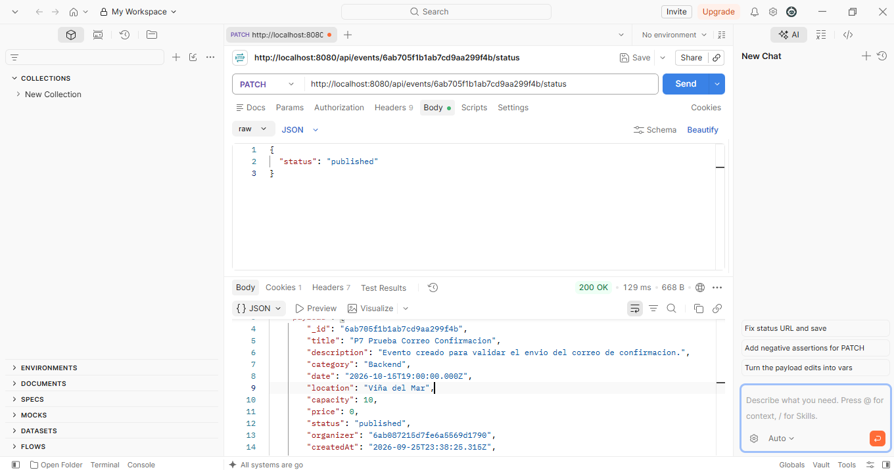

### 1.2 Inscripción exitosa
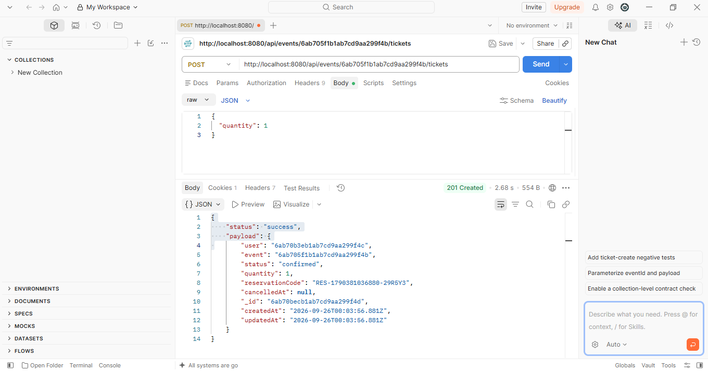

### 1.3 Correo de confirmación recibido
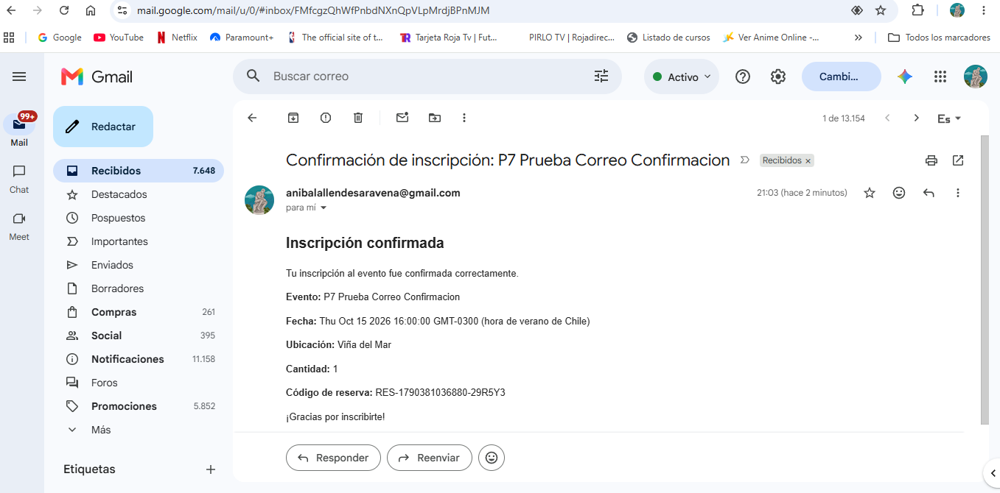

---

## Caso 2 — Registro sin sesión

**Resultado esperado:** HTTP 401 Unauthorized.

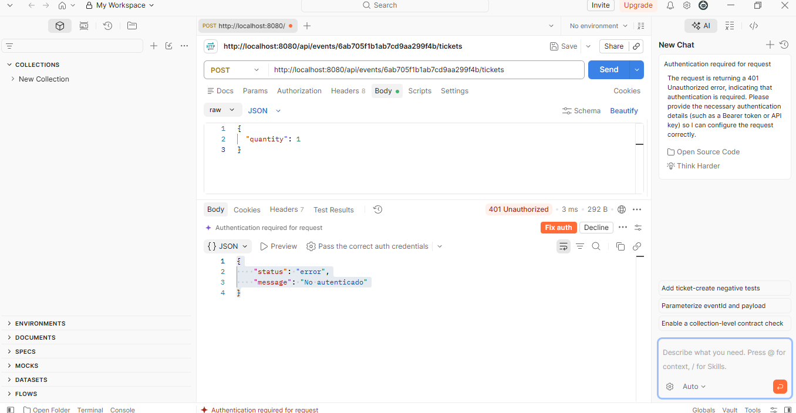

---

## Caso 3 — Evento inexistente

**Resultado esperado:** HTTP 404 Not Found.

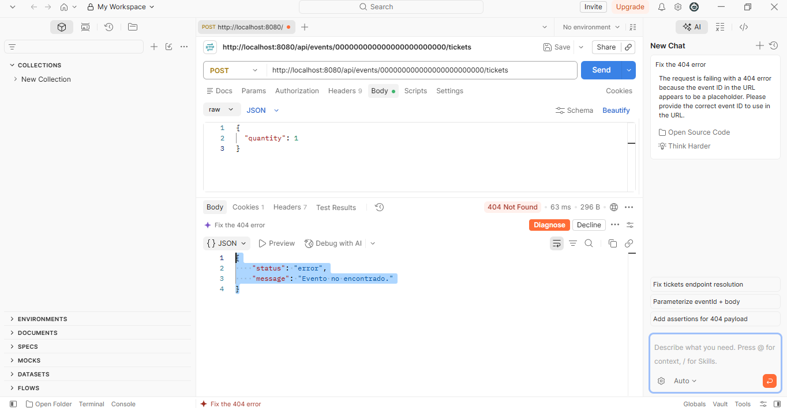

---

## Caso 4 — Inscripción en evento cancelado

**Resultado esperado:** HTTP 400 Bad Request.

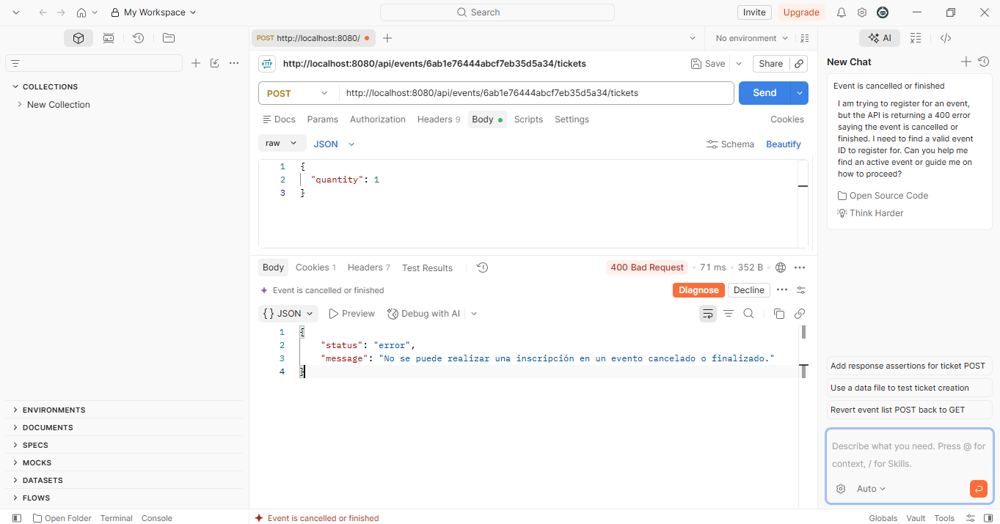

---

## Caso 5 — Capacidad insuficiente

**Resultado esperado:** HTTP 400 Bad Request.

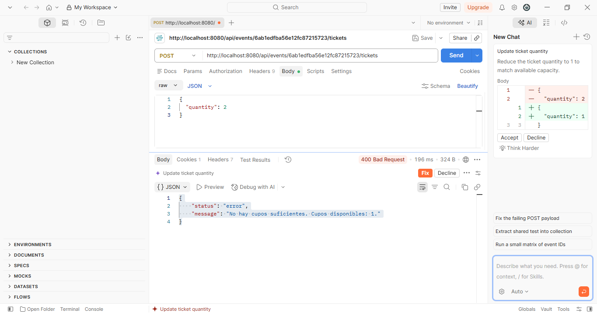

---

## Caso 6 — Inscripción duplicada

**Resultado esperado:** HTTP 400 Bad Request.

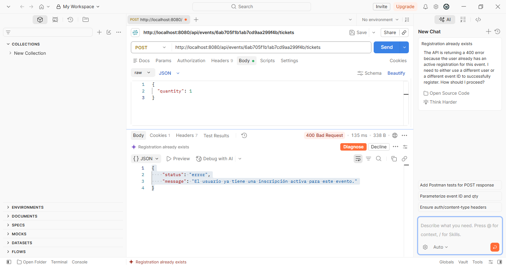

---

## Caso 7 — Cancelación y reinscripción

### 7.1 Cancelación del ticket

La cancelación mantiene el ticket registrado con estado `cancelled` y registra `cancelledAt`.

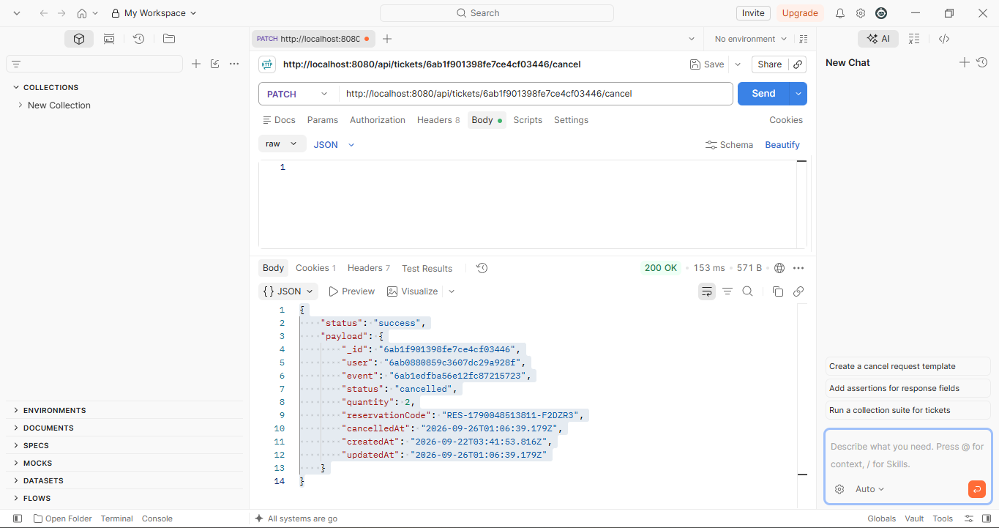

### 7.2 Reinscripción después de cancelar

La nueva inscripción genera un ticket confirmado, demostrando que el cupo liberado puede volver a utilizarse.

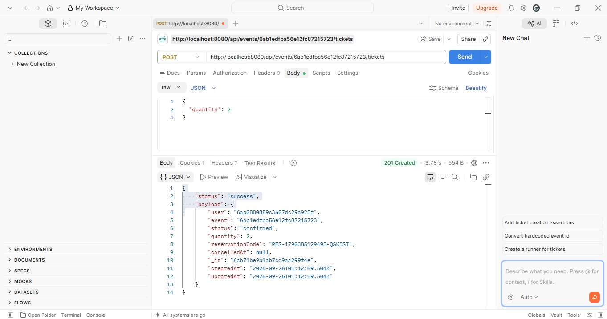

---

## Caso 8 — Usuario intenta cancelar ticket ajeno

**Resultado esperado:** HTTP 403 Forbidden.

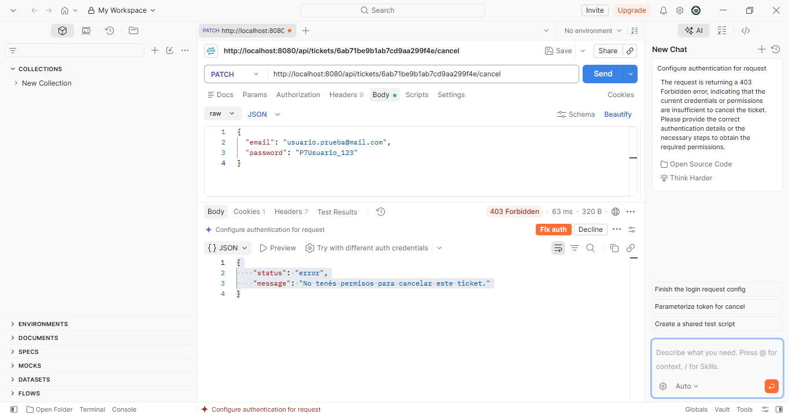

---

## Caso 9 — Usuario consulta tickets de un evento

**Resultado esperado:** HTTP 403 Forbidden para un usuario que no posee permisos de organizador/admin.

---

## Caso 10 — Organizador consulta tickets de otro organizador

**Resultado esperado:** HTTP 403 Forbidden.

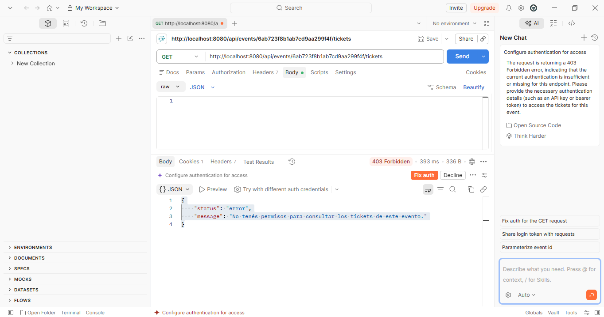

---

## Resumen de evidencias

| Caso | Prueba | Resultado |
|---|---|---|
| 1 | Inscripción exitosa y correo | 201 Created |
| 2 | Sin sesión | 401 Unauthorized |
| 3 | Evento inexistente | 404 Not Found |
| 4 | Evento cancelado | 400 Bad Request |
| 5 | Capacidad insuficiente | 400 Bad Request |
| 6 | Inscripción duplicada | 400 Bad Request |
| 7 | Cancelación y reinscripción | 200 OK / 201 Created |
| 8 | Cancelar ticket ajeno | 403 Forbidden |
| 9 | Usuario consulta tickets | 403 Forbidden |
| 10 | Organizador consulta otro evento | 403 Forbidden |
